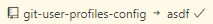
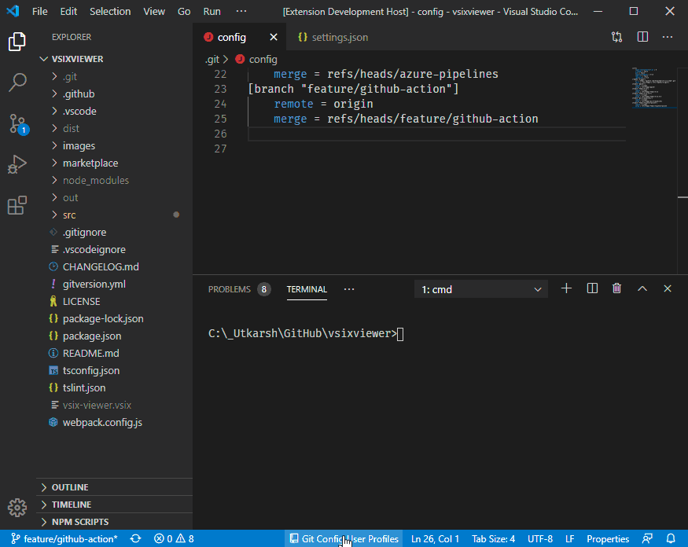
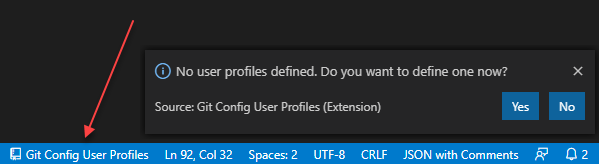
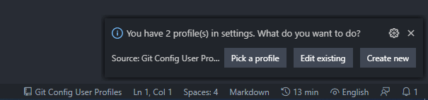
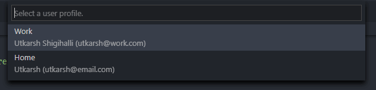
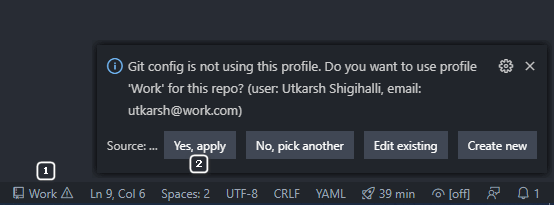
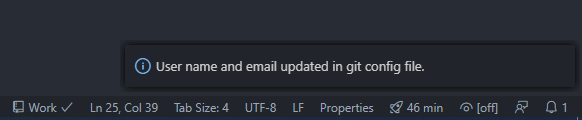
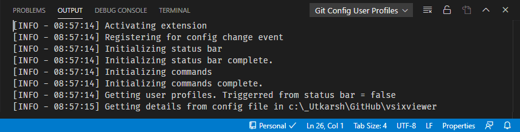

# 说明

基于[git-config-user-profiles](https://github.com/onlyutkarsh/git-config-user-profiles.git)进行修改:

1. 增加配置 `gitConfigUser.statusBarLocation`, 可设置在状态栏的位置, 默认为 `left` 居左
   因为个人习惯, 提交时会看下分支等情况, 都放左边便于查看.

   

2. 选择 profile 后, 将 profiles 信息保存到当前 workspace 下, 原逻辑直接修改全局的话, 会导致其他项目也跟着变.
   目前存在需要开多个窗口, 对应的多个 git 仓库(gitlab, github 等), 而且账号信息不同等情况.
3. 选中 profile 后, 立即更新 git config 中, 不再二次确认.
4. 首次打开项目时, 如项目下.git/config 中未配置用户信息,
   4.1 如有配置 profiles, 则自动行设置, 默认选择 selected, 如无 selected 的, 取第一个
   4.2 如未配置 profiles, 走原逻辑, 提示新增 user profile
5. 以上是针对个人使用情况进行的修改.

## 命令记录

```
npm install
vsce package
```

# Git Config User Profiles

Ever wanted to use different username and email addresses for your commits at work and for your personal repositories? While it is easy to do using `git config` command, this extension allows you to maintain different username and email in named profiles and allows you to easily switch and apply to the repository you are working.



## Usage

### Creating the profiles

---

Once you install extension, click on 'Git Config Profiles' on the VSCode Status Bar and define few profiles.



> Profiles defined are stored in global settings file in VSCode so that they are available for all other repositories.

<br/>

### Selecting the profile

---

Click on the status bar and if you have profiles you will presented with a dialog as below.



Click `Pick a profile` and then select a profile you need.



<br/>

### Setting the profile selected to the repo

---

Once you select a profile, the status bar text changes to selected profile name [1 in image below].

> The icon might display a "warning" sign if the current repo is not using the username and email selected.

If you want to apply the username and email defined in the selected profile to the current repository, click on profile name in the status bar (e.g `Work` ) and then select `Yes, apply` in the dialog [2 image below].



Once the repository's username and email are in sync, you might see a check icon confirming that repository config is in sync with the profile selected.



### Issues and feature requests

If you find any bug or have any suggestion/feature request, please submit the [issue](https://github.com/onlyutkarsh/git-config-user-profiles/issues) in the GitHub repo. It is helpful to troubleshoot if you paste results of `Output` window when submitting issues.


